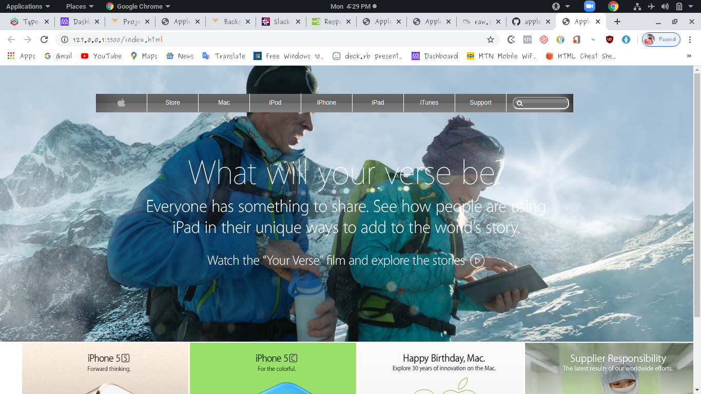

# BUILDING WITH BACKGROUNDS AND GRADIENTS

Additional description about the project and its features.

## Built With

- HTML,
- CSS

## Live Demo

[Live Demo Link](https://rawcdn.githack.com/ignatius22/apple-clone/2fbbb96d7a6a8a08314cb101fa12bf6e931a4d05/index.html)

## Getting Started

**This is an example of how you may give instructions on setting up your project locally.**
**Modify this file to match your project, remove sections that don't apply. For example: delete the testing section if the currect project doesn't require testing.**

To get a local copy up and running follow these simple example steps.

### Setup